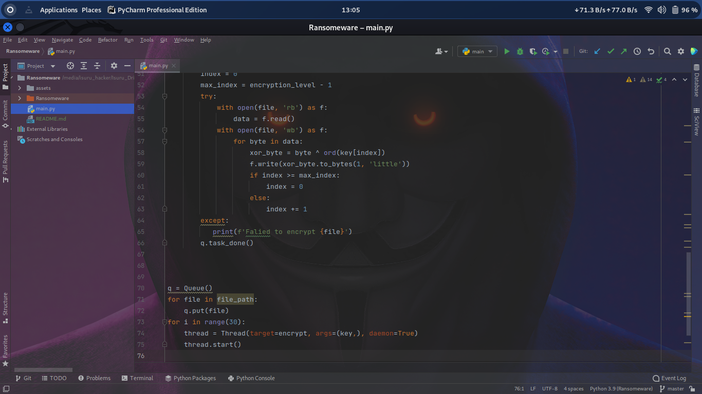

<h1 align="center">This is Ransomeware</h1>

<h2 align="center">Used Programming Skills : Python</h2>
- Run this and give the extension you want and you can delete and encrypt the files related to that extension

## :link: **Other Links**
- LinkedIn : [Click Here](http://www.linkedin.com/in/isurulakmal99)
- Whatsapp : [Click Here](https://wa.me/message/GWIVXWGZ6AO6F1)
- Facebook : [Click Here](https://www.facebook.com/anushkaisurulakmal.lakmal/)
- Twitter  : [Click Here](https://twitter.com/AnushkaIsuru72?t=5B3SsIFbGZhhmsYqXuX0Yg&s=09)

<a href="https://github.com/pasindulakshankudaligama/Readme-File-Styles">
Isuru Lakmal Readme Profile !
</a>

  

